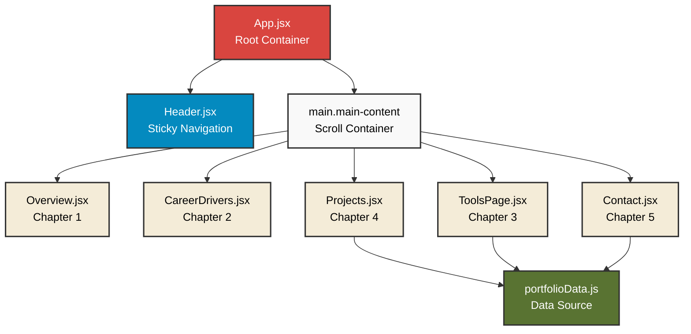
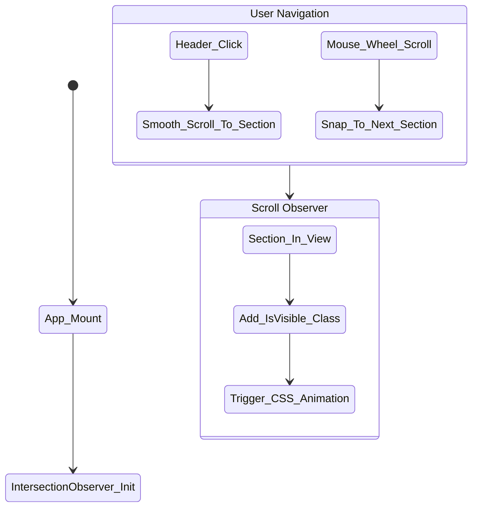
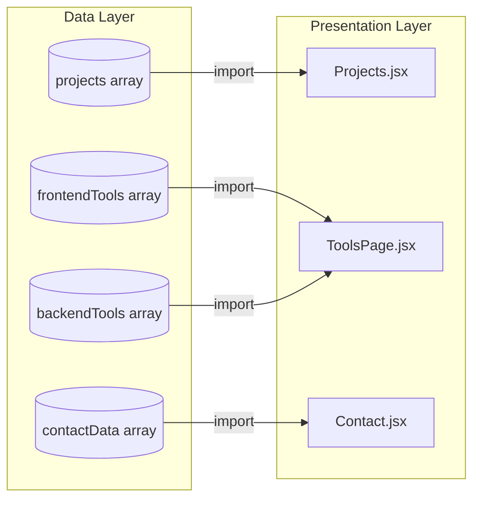

# 🦸‍♂️ Huỳnh Minh Trí - Comic Portfolio

Welcome to my personal portfolio! This project is a uniquely designed, interactive web application built with **React** and **Vite**. It breaks away from traditional portfolio formats by adopting a vibrant, comic-book-inspired aesthetic complete with dynamic layouts, scroll-triggered animations, and floating sticker effects.

## 🌟 Features

- **Comic-Book Aesthetics:** Features halftone patterns, speech bubbles, bold "Bangers" typography, and heavy drop shadows to simulate a real comic book.
- **Scroll-Snapping Navigation:** Smooth, chapter-by-chapter scrolling experience utilizing CSS `scroll-snap` (optimized for desktop).
- **Fully Responsive (Mobile-First Layout):** Ensures a flawless viewing experience across all devices, with intelligent stacking, scrollable text boxes, and adaptive viewport sizing on mobile (down to 320px).
- **Intersection Observer Animations:** Elements dynamically animate and reveal themselves as you scroll through the chapters.
- **Data-Driven Architecture:** All project portfolios, tool stacks, and contact information are cleanly abstracted into a central `portfolioData.js` file for easy updates.
- **Visitor Analytics:** Integrated with **Vercel Analytics** to track page views and audience insights invisibly.

---

## 🛠️ Tech Stack

- **Framework:** React 19 + Vite
- **Styling:** Vanilla CSS (CSS Modules for component scoping)
- **Icons:** Devicon
- **Tracking:** @vercel/analytics
- **Deployment:** Vercel

---

## 🏗️ Architecture & Diagrams

Below are the architectural diagrams outlining the structure and flow of the application.

### 1. Component Tree Diagram

This diagram visualizes the nested structure of our React components, from the root `App` container down to individual chapters.



### 2. Navigation Flow Diagram

Illustrates how users navigate between chapters, showing the interaction between manual scrolling, button clicks, and the Intersection Observer API triggering CSS animations.



### 3. Data Flow Diagram

Shows how static content is decoupled from presentation logic, mapping the flow from `portfolioData.js` to the respective pages.



---

## 🚀 Getting Started

To run this project locally on your machine:

1. **Clone the repository**
   ```bash
   git clone https://github.com/MinhTriHuynh1003/comic-portfolio.git
   ```

2. **Navigate into the directory**
   ```bash
   cd comic-portfolio
   ```

3. **Install dependencies**
   ```bash
   npm install
   ```

4. **Start the development server**
   ```bash
   npm run dev
   ```
   *The server will typically start on `http://localhost:5173`.*

## 📬 Contact & Links
- **GitHub:** [MinhTriHuynh1003](https://github.com/MinhTriHuynh1003)
- Feel free to reach out via the channels listed in the Contact section of the portfolio!

## 📝 License
Created by Huỳnh Minh Trí. All rights reserved.
