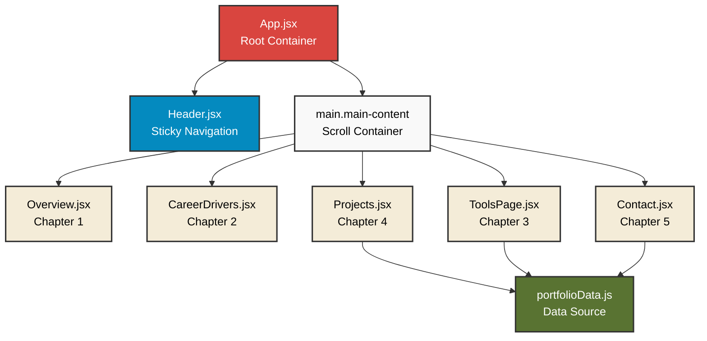
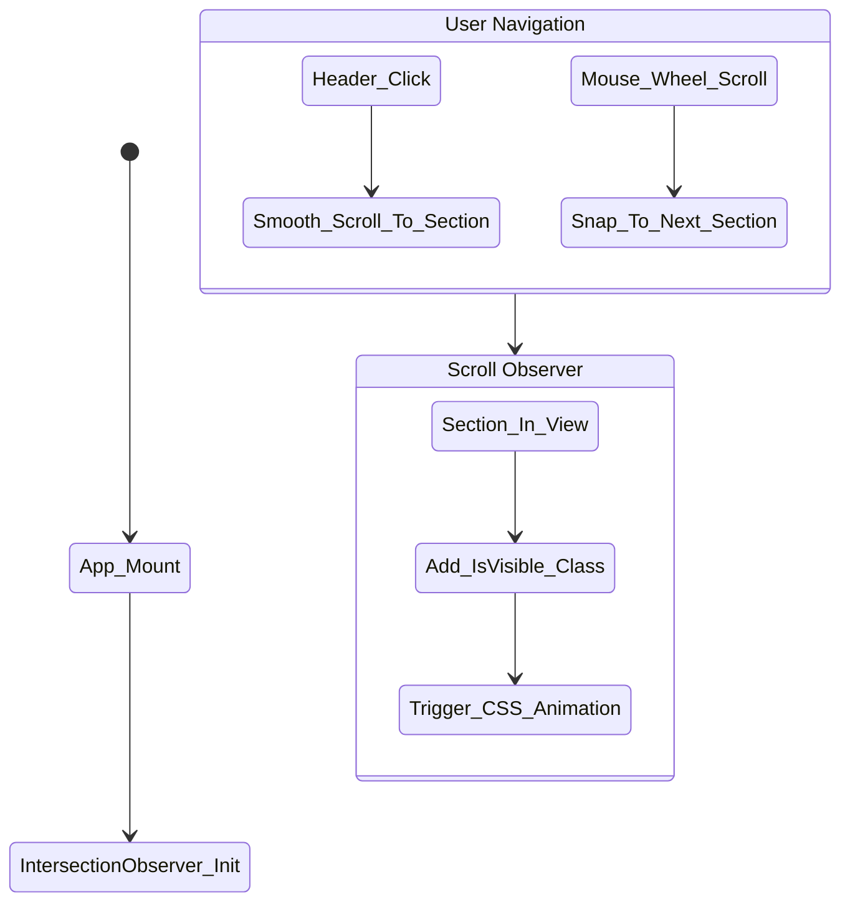
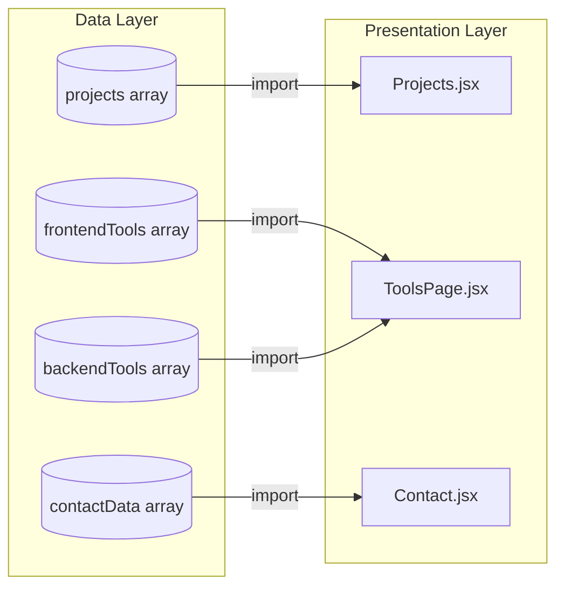

# Comic Portfolio Architecture Diagrams

Tài liệu này bao gồm các sơ đồ kiến trúc và luồng dữ liệu cho dự án Comic Portfolio, được thiết kế bằng Mermaid.js. Bạn có thể sử dụng các extension xem trước Mermaid (như Mermaid Preview trên VSCode) để xem hình ảnh trực quan.

## 1. Component Tree Diagram

Sơ đồ cây thể hiện cấu trúc lồng ghép của các thành phần giao diện (React Components).

## 2. Navigation Flow Diagram

Sơ đồ thể hiện cách người dùng điều hướng qua lại giữa các trang trong ứng dụng.

## 3. Data Flow Diagram

Sơ đồ thể hiện luồng dữ liệu truyền từ file dữ liệu tĩnh (portfolioData) đến các trang hiển thị.

